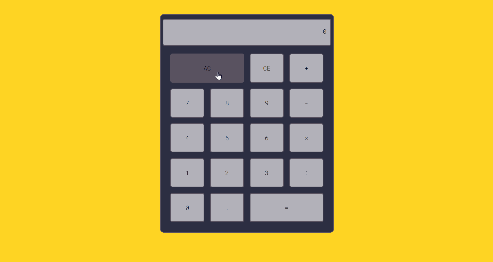

# Calculator

A simple calculator that can do basic operations, with integer and floating numbers.

You can also clear the last digit or reset everything with CE and AC buttons.

## Demo

## Keyboard Support

You can control the calculator with your keyboard!

| Key               | Key Function  |
| ----------------- |:-------------:|
| `0` to `9`        | numbers       |
| `.`               | float         |
| `+`, `-`, `*`, `/`| operations    |
| `Enter`           | equal         |
| `Backspace`       | CE            |
| `Escape`          | AC            |
